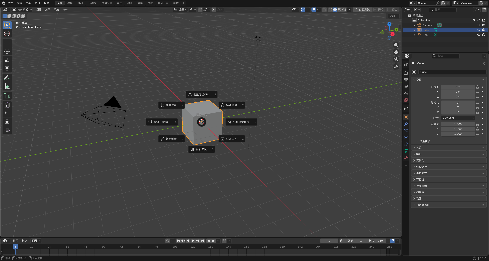

# ⚡ Blender SPARK Addon

**SPARK** — **S**mart **P**recision **A**lignment, **R**endering & **K**inematics

> 常用操作收进 **饼图菜单 + 快捷键**；并补上 Blender 没有或默认很绕的能力：测量可随文件保存、批量导出带原点信息、2D 平面机构求解、以及视口预览与 OpenGL 截图在 Filmic/AgX 下的色差问题。

**English documentation:** [README_EN.md](README_EN.md)




---

## ✨ 功能一览

### 📐 智能测量与标注

自带测量量完不好留在场景里对照。这里把结果做成 **可随文件保存、可清理、可调样式** 的视口标注，编辑网格时相关测量还能跟着更新。

- 距离、角度、半径/直径、面积、周长、弧长等；偏好里可关自动存读、调字体与视距裁剪。

### 🎯 对齐与高精度变换

多对象「底对齐、顶对齐、等距排布」用默认方式往往要点很多次菜单。这里把多种对齐方式收在一起；侧栏 **变换（增强）** 显示 **完整小数**，方便和图纸或外部数据核对。开启「只改原点」相关选项时，可按场景同步原点。

- 对象/顶点对齐、底部对齐、展平、沿边对齐、等距分布。

### 🪞 镜像增强（`Ctrl+M`）

Blender 自带 Mirror，但多物体、要对齐到 **别的物体当对称面**、或要在 **「只加修改器」和「复制一份再镜像」** 之间切换时，步骤仍然偏多，所以用增强入口串起来。

- **仅添加修改器**：多选物体 **批量** 加 Mirror；对称面由 **镜像物体** 决定（跟参照物走，不限于本物体自身坐标）；镜像面上是否 **合并顶点** 可自己关开。
- **复制并镜像**：复制 → 临时镜像 → **烘焙成实体网格** → **删掉镜像平面一侧** → 可选把 **原点移到对称侧**。得到的是 **不再挂 Mirror 的网格**，适合继续细分、导出，或避免长期保留镜像修改器时，在镜像缝上常见的 **接缝着色、中缝拓扑** 等问题。

### 📦 批量导出 / 重命名 / 材质

导出 OBJ、改名字、套材质，资产一多就要重复同一套操作。这里支持 **批量 OBJ（可选附带原点信息文本）**、**正则改名**（含重名时跳过/覆盖/加后缀）、以及 **批量应用材质 / 整理槽 / 清未使用**；还可按场景选项做 **材质通道同步**（如跟活动材质对齐基础参数）。

### 🔧 2D 运动学

Blender 没有「平面连杆机构求位置」这类工具，夹具、连杆机构往往靠手摆。这里提供 **2D 平面** 下的数值求解（如 Newton–Raphson）、关节与驱动、极限与演示场景，用来摆 **2D 机构**，而不是当动画骨骼用。

### 🎨 所见即所得视口渲染

用 Filmic、AgX 等视图变换时，**视口里看到的颜色** 和 **渲染视口 OpenGL 得到的那张图** 往往不一致，对材质会误判。该功能会 **暂时切到 Standard 视图变换** 再渲 OpenGL，看完用菜单里的 **恢复色彩设置** 还原。

### 其它

| 功能 | 说明 |
|------|------|
| **FPS 叠加** | 视口左下角实时帧率；静止画面也会刷新读数。 |
| **性能测试** | 大量带随机材质的立方体 + 随机运动，粗测本机/场景压力。 |
| **一键优化** | 合并近点、删内部面、溶解退化几何、减面等，集成在一步里。 |
| **小键盘 · 智能定位** | 单击：框选居中；双击：在 **大纲** 里定位到当前物体。 |

---

## 🧭 界面与入口（在哪里找功能）

| 入口 | 说明 |
|------|------|
| **`` ` `` 键**（重音键，常与 Esc 下方同键） | 打开 **增强工具饼图菜单**，是主功能入口。 |
| **鼠标侧键**（常见为前进键 / Button4） | 与 `` ` `` 相同，呼出同一饼图菜单。 |
| **3D 视图侧栏** | 插件提供多个面板（变换增强、测量、对齐、运动学等，随 Blender 版本与布局可能略有差异）。 |
| **视图（View）菜单** | 含 **所见即所得视口渲染** 等入口。 |
| **添加修改器菜单** | 含 **镜像（增强）** 等入口。 |
| **3D 视图 Header** | 提供 **性能测试** 等快捷入口。 |

---

## 🚀 安装与更新

### 方式一：下载发行包（推荐）

1. 打开 [Releases](https://github.com/LingCore/Blender-SPARK-Addon/releases) 下载 `blender_spark_addon_v*.zip`（或由本仓库 `pack_addon.py` 本地生成）。
2. Blender → **编辑** → **偏好设置** → **插件** → **从磁盘安装**，选中 zip。
3. 列表中勾选启用 **Blender SPARK Addon**。

### 方式二：直接使用源码目录

1. 克隆或下载本仓库。
2. 将 **`bofu_enhanced`** 整个文件夹复制到 Blender 用户插件目录，例如 Windows：

   `%APPDATA%\Blender Foundation\Blender\4.2\scripts\addons\`

3. 在 **偏好设置 → 插件** 中搜索并启用 **Blender SPARK Addon**。

### 版本与兼容性

- 插件 **最低 Blender 版本** 以 `bofu_enhanced/__init__.py` 中 `bl_info["blender"]` 为准（当前为 **4.2+**）。
- 若你使用 **4.3 / 5.x**，请优先在对应版本下测试；若遇 API 变更，欢迎通过 Issue 反馈。

---

## 🎮 快捷键速查

| 快捷键 | 功能 |
|--------|------|
| `` ` `` / 鼠标侧键 | 打开 **增强工具饼图菜单**（主入口） |
| `Ctrl + M` | 镜像增强 |
| `Ctrl + F` | 批量重命名 |
| 小键盘 `.` | 智能定位 |

> 快捷键在 **插件启用** 且 **键位映射未冲突** 时生效；若与其它插件冲突，可在 **偏好设置 → 键位映射** 中搜索 `bofu` / `SPARK` 相关项自行调整。

---

## 📋 依赖说明

| 组件 | 说明 |
|------|------|
| **Blender** | ≥ 4.2（与 `bl_info` 一致）。 |
| **Python** | 使用 Blender 内置解释器即可，无需单独安装。 |
| **NumPy** | **可选**；`operators_measure` / 运动学等在大量数据时会尝试使用。 |

---

## 📦 从源码打包

```bash
python pack_addon.py
```

或在 Windows 下双击 **`pack_addon.bat`**。生成的 zip 文件名包含版本号，版本取自 **`bofu_enhanced/__init__.py`** 中的 **`bl_info["version"]`**。

---

## 🗂 源码结构（给贡献者）

| 路径 | 职责 |
|------|------|
| `bofu_enhanced/__init__.py` | 注册/注销、快捷键、`depsgraph` / 保存 / 加载 处理器、菜单挂载 |
| `bofu_enhanced/properties.py` | 场景 PropertyGroup |
| `bofu_enhanced/preferences.py` | 插件偏好（标注样式、自动保存标注等） |
| `bofu_enhanced/annotation*.py` | 标注核心、绘制与持久化 |
| `bofu_enhanced/operators_*.py` | 各功能操作符 |
| `bofu_enhanced/ui.py` | 饼图、子菜单、面板 |
| `pack_addon.py` | 打包脚本 |

---

## 📄 许可证

[GPL-3.0](LICENSE)

---

**Made with ❤️ by [LingCore](https://github.com/LingCore)**
